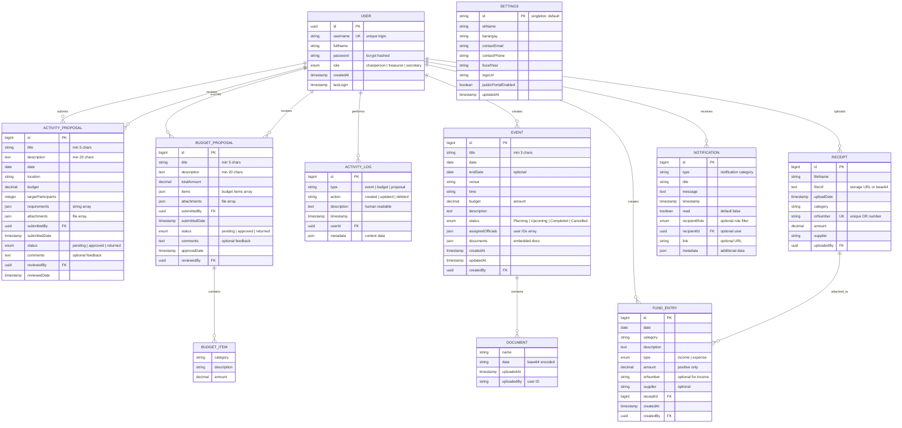
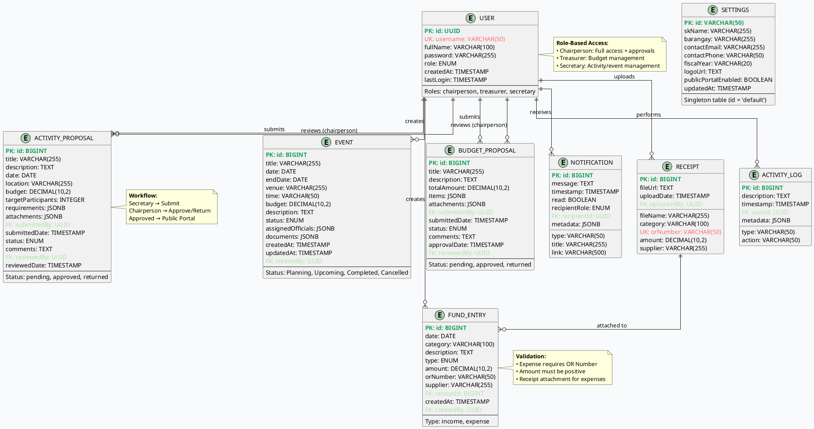

# 🗄️ SK Digital Management System - Entity Relationship Diagram

## Mermaid ERD (Copy the code block below)



---

## Alternative: PlantUML ERD (Copy the code block below)



---

## Alternative: dbdiagram.io Code (Copy the code block below)

```dbdiagram
// SK Digital Management System - Entity Relationship Diagram
// Paste this code at: https://dbdiagram.io/

Table users {
  id uuid [pk, default: `uuid_generate_v4()`]
  username varchar(50) [unique, not null]
  full_name varchar(100) [not null]
  password varchar(255) [not null, note: 'bcrypt hashed']
  role varchar(20) [not null, note: 'chairperson | treasurer | secretary']
  created_at timestamp [default: `now()`]
  last_login timestamp
  
  indexes {
    username
    role
  }
  
  Note: 'SK official user accounts with role-based permissions'
}

Table events {
  id bigserial [pk]
  title varchar(255) [not null]
  date date [not null]
  end_date date
  venue varchar(255) [not null]
  time varchar(50) [not null]
  budget decimal(10,2) [not null]
  description text [not null]
  status varchar(20) [not null, default: 'Planning', note: 'Planning | Upcoming | Completed | Cancelled']
  assigned_officials jsonb [default: '[]']
  documents jsonb [default: '{"photos":[],"receipts":[],"attendance":null,"others":[]}']
  created_at timestamp [default: `now()`]
  updated_at timestamp [default: `now()`]
  created_by uuid [ref: > users.id]
  
  indexes {
    status
    date
    created_by
  }
  
  Note: 'SK events and activities with scheduling and budget tracking'
}

Table fund_entries {
  id bigserial [pk]
  date date [not null]
  category varchar(100) [not null]
  description text [not null]
  type varchar(10) [not null, note: 'income | expense']
  amount decimal(10,2) [not null]
  or_number varchar(50)
  supplier varchar(255)
  receipt_id bigint [ref: > receipts.id]
  created_at timestamp [default: `now()`]
  created_by uuid [ref: > users.id]
  
  indexes {
    type
    category
    date
    created_by
  }
  
  Note: 'Income and expense transactions for budget management'
}

Table activity_proposals {
  id bigserial [pk]
  title varchar(255) [not null]
  description text [not null]
  date date [not null]
  location varchar(255) [not null]
  budget decimal(10,2) [not null]
  target_participants integer [not null]
  requirements jsonb [default: '[]']
  attachments jsonb [default: '[]']
  submitted_by uuid [not null, ref: > users.id]
  submitted_date timestamp [default: `now()`]
  status varchar(20) [not null, default: 'pending', note: 'pending | approved | returned']
  comments text
  reviewed_by uuid [ref: > users.id]
  reviewed_date timestamp
  
  indexes {
    status
    submitted_by
    reviewed_by
  }
  
  Note: 'Activity proposals submitted by Secretary for Chairperson approval'
}

Table budget_proposals {
  id bigserial [pk]
  title varchar(255) [not null]
  description text [not null]
  total_amount decimal(10,2) [not null]
  items jsonb [not null, default: '[]']
  attachments jsonb [default: '[]']
  submitted_by uuid [not null, ref: > users.id]
  submitted_date timestamp [default: `now()`]
  status varchar(20) [not null, default: 'pending', note: 'pending | approved | returned']
  comments text
  approval_date timestamp
  reviewed_by uuid [ref: > users.id]
  
  indexes {
    status
    submitted_by
    reviewed_by
  }
  
  Note: 'Budget proposals submitted by Treasurer for Chairperson approval'
}

Table notifications {
  id bigserial [pk]
  type varchar(50) [not null]
  title varchar(255) [not null]
  message text [not null]
  timestamp timestamp [default: `now()`]
  read boolean [default: false]
  recipient_role varchar(20)
  recipient_id uuid [ref: > users.id]
  link varchar(500)
  metadata jsonb [default: '{}']
  
  indexes {
    recipient_id
    read
    (timestamp, 'DESC')
  }
  
  Note: 'System notifications for approvals, comments, and updates'
}

Table receipts {
  id bigserial [pk]
  file_name varchar(255) [not null]
  file_url text [not null]
  upload_date timestamp [default: `now()`]
  category varchar(100) [not null]
  or_number varchar(50) [unique, not null]
  amount decimal(10,2) [not null]
  supplier varchar(255) [not null]
  uploaded_by uuid [ref: > users.id]
  
  indexes {
    or_number
    category
    uploaded_by
  }
  
  Note: 'Receipt documents for expense verification'
}

Table activity_logs {
  id bigserial [pk]
  type varchar(50) [not null]
  action varchar(50) [not null]
  description text [not null]
  timestamp timestamp [default: `now()`]
  user_id uuid [ref: > users.id]
  metadata jsonb [default: '{}']
  
  indexes {
    user_id
    (timestamp, 'DESC')
    type
  }
  
  Note: 'Audit trail of all system actions'
}

Table settings {
  id varchar(50) [pk, default: 'default']
  sk_name varchar(255) [not null]
  barangay varchar(255) [not null]
  contact_email varchar(255)
  contact_phone varchar(50)
  fiscal_year varchar(20) [not null]
  logo_url text
  public_portal_enabled boolean [default: true]
  updated_at timestamp [default: `now()`]
  
  Note: 'System-wide configuration (singleton table)'
}

// Relationships are defined using [ref: > table.column] above

// Additional relationship labels
Ref: users.id < activity_proposals.submitted_by [note: 'Secretary submits activity proposals']
Ref: users.id < activity_proposals.reviewed_by [note: 'Chairperson reviews/approves']
Ref: users.id < budget_proposals.submitted_by [note: 'Treasurer submits budget proposals']
Ref: users.id < budget_proposals.reviewed_by [note: 'Chairperson reviews/approves']
Ref: users.id < activity_logs.user_id [note: 'User performs actions']
```

---

## Alternative: Simple Text-Based ERD (ASCII)

```
╔════════════════════════════════════════════════════════════════════════╗
║                  SK DIGITAL MANAGEMENT SYSTEM - ERD                    ║
╚════════════════════════════════════════════════════════════════════════╝

┌─────────────────┐
│     USER        │
├─────────────────┤
│ PK id           │
│    username     │───┐
│    fullName     │   │
│    password     │   │ submits (1:N)
│    role         │   │
│    createdAt    │   │
│    lastLogin    │   │
└─────────────────┘   │
        │             │
        │ creates     ├──────────────────────┐
        │ (1:N)       │                      │
        │             │                      │
        ▼             ▼                      ▼
┌─────────────────┐ ┌──────────────────┐ ┌──────────────────┐
│     EVENT       │ │ ACTIVITY_PROPOSAL│ │ BUDGET_PROPOSAL  │
├─────────────────┤ ├──────────────────┤ ├──────────────────┤
│ PK id           │ │ PK id            │ │ PK id            │
│    title        │ │    title         │ │    title         │
│    date         │ │    description   │ │    description   │
│    venue        │ │    date          │ │    totalAmount   │
│    budget       │ │    location      │ │    items (JSON)  │
│    status       │ │    budget        │ │    attachments   │
│    documents    │ │    requirements  │ │ FK submittedBy   │──┘
│ FK createdBy    │ │ FK submittedBy   │──┘ FK reviewedBy   │
└─────────────────┘ │ FK reviewedBy    │ │    status        │
                    │    status        │ └──────────────────┘
                    └──────────────────┘
        │
        │ uploads (1:N)
        │
        ▼
┌─────────────────┐         ┌─────────────────┐
│    RECEIPT      │────────>│  FUND_ENTRY     │
├─────────────────┤  1:N    ├─────────────────┤
│ PK id           │         │ PK id           │
│    fileName     │         │    date         │
│    fileUrl      │         │    category     │
│    orNumber     │         │    description  │
│    amount       │         │    type         │
│    supplier     │         │    amount       │
│ FK uploadedBy   │         │ FK receiptId    │
└─────────────────┘         │ FK createdBy    │
                            └─────────────────┘

        │
        │ receives (1:N)
        │
        ▼
┌─────────────────┐         ┌─────────────────┐
│  NOTIFICATION   │         │  ACTIVITY_LOG   │
├─────────────────┤         ├─────────────────┤
│ PK id           │         │ PK id           │
│    type         │         │    type         │
│    title        │         │    action       │
│    message      │         │    description  │
│    read         │         │    timestamp    │
│ FK recipientId  │<────────│ FK userId       │
└─────────────────┘  1:N    └─────────────────┘

┌─────────────────┐
│    SETTINGS     │
├─────────────────┤
│ PK id           │
│    skName       │
│    barangay     │
│    fiscalYear   │
│    logoUrl      │
└─────────────────┘

LEGEND:
━━━━━━
PK = Primary Key
FK = Foreign Key
───> = One-to-Many Relationship
```

---

## How to Use These Diagrams

### 1. **Mermaid (Recommended)**
- Copy the Mermaid code block
- Paste into GitHub README.md or any `.md` file
- Renders automatically on GitHub, GitLab, Notion, etc.
- Online editor: https://mermaid.live/

### 2. **PlantUML**
- Copy the PlantUML code
- Use online editor: https://www.plantuml.com/plantuml/uml/
- Or install PlantUML locally
- Export as PNG/SVG

### 3. **dbdiagram.io (Interactive)**
- Copy the dbdiagram code
- Go to: https://dbdiagram.io/
- Paste code in left panel
- Interactive, exportable ERD appears

### 4. **ASCII (Universal)**
- Copy ASCII diagram
- Paste anywhere (documentation, comments, emails)
- Works in all text editors

---

**Pro Tip:** For presentations, use dbdiagram.io for the most professional-looking, interactive ERD that you can export as PNG or PDF!
